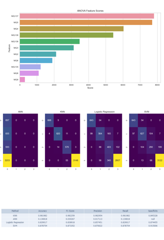

# beef-quality-assessment-using-E-nose-sensor-

Ensuring safe food supplies has recently become a serious problem all over the world. Controlling the quality, spoilage, and standing time for products with a short shelf life is a quite difficult problem. However, electronic noses can make all these controls possible. In this study, which aims to develop a different approach to the solution of this problem, electronic nose data obtained from 12 different beef cuts were classified. In the dataset, there are four classes (0: excellent, 1: good, 2: acceptable, and 3: spoiled) indicating beef quality. The classifications were performed separately for each cut and all cut shapes. The ANOVA method was used to determine the active features in the dataset with data for 12 features. The same classification processes were carried out by using the three active features selected by the ANOVA method. Three different machine learning methods, Artificial Neural Network, K Nearest Neighbor, and Logistic Regression, which are frequently used in the literature, were used in classifications. In the experimental studies, a classification accuracy of 100% was obtained as a result of the classification performed with ANN using the data obtained by combining all the tables in the dataset.

Reference:
Feyzioglu, A.; Taspinar, Y.S. Beef Quality Classification with Reduced E-Nose Data Features According to Beef Cut Types. Sensors 2023, 23, 2222. https://doi.org/10.3390/s23042222

